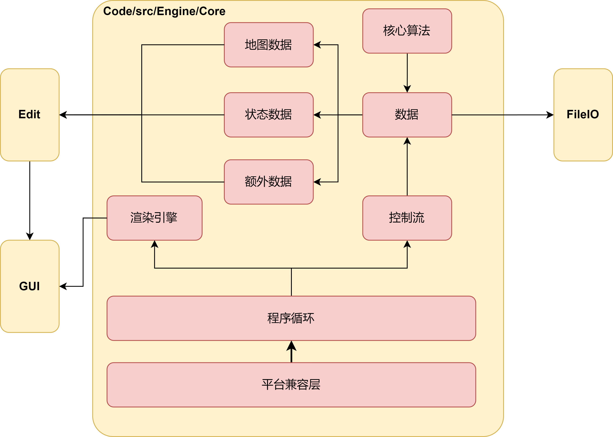

# 总体规划

项目文件结构为：

─TilesMaker
    ├─Doc              // 文档
    └─TileMaker
        ├─Code
        │      ├─App  // 编译可执行程序，需要链接其余部分
        │      ├─src    // 核心功能实现
        │      └─Test  // 测试代码 
        ├─Resource // 非代码资源
        └─ThirdParty  // 第三方库

将分阶段完成项目，目前第一阶段的目标是实现**最小可运行程序**。

项目将有三个部分构成，Tools提供必备的工具为其余部分使用，Engine部分实现项目的核心功能，并提供扩展性，最终生成链接库，App部分生成可执行文件。

整体框架目前如下，各个大模块直接将不会有任何耦合，互相直接只通过链接库连接。

整个项目会分阶段实现，目前的目标是实现core，并给GUI，Edit，FIleIO模块留下足够的扩展性。

## Core模块

core内部大致设计如下，外部模块对Core模块的交互将通过事件驱动，渲染部分可能触及到性能问题，会专门设计。

具体来说：

平台兼容层提供对不同编译器，不同操作系统需要使用到API等的封装，当然由于会使用SFML库，大部分的API都是跨平台兼容的，但是可能还会涉及到没有封装到的API，所有有了这一层。

程序循环将会封装在class Engine内，整个Edit，GUI，FileIO模块实际上将在Engine内调用运行。

整个渲染会使用layer实现，即每一个需要渲染的对象都继承RenderLayer类，渲染引擎自动调用。

控制流使用事件驱动。

数据部分需要研究TMX文件格式，由于需要对Edit进行支持，需要额外设计状态数据，实现包括回退重做等在内的功能。
