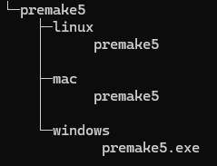
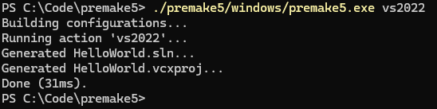

## make工具

准备制作一个工程项目的时候，首先会考虑它的目标平台，要支持Windows平台可能会考虑使用Visual Studio，Mac平台可能会使用XCode，Linux下会有自己的工具链，如果想让你的工程能够跨平台编译，或者避免在IDE菜单里手动一个个配置，那么将会用到make工具。

make工具有许多，比如最为知名的make和camke，make是各个平台下最原始的make工具，Linux下使用较多，不推荐直接编写，一般会通过其他make工具生成makefile以使用，cmake是应用最广泛的make工具，但语法陈旧，很难使用，编写cmake的难度非常大，个人不推荐使用。

除了最常见的这两个make工具，还有xmake，nmake，bazel等，不过本文以及之后的教程中将会主要使用premake，这个make工具只有一个文件，使用lua编写make脚本，使用起来十分方便，premake在游戏领域使用的比较广泛，主要是因为lua脚本在游戏中比较常见。

premake工具会读取premake5.lua文件，并通过该文件生成不同平台下的配置文件，比如在Windows下生成Visual Studio工程，Mac下生成XCode工程，Linux下生成makefile文件。

## premake5教程

在此我们将使用premake5构建一个Hello Wolrd程序，以下将以Windows平台为例。

在你喜欢的地方新建一个空文件夹，后续的步骤将在这个文件夹内进行，该目录作为项目的根目录。

在[premake官网](https://premake.github.io/)下载对应平台的premake5工具，下载完的压缩包离只有一个文件，这就是我们使用到的工具，在文件夹内新建一个premake5文件夹用于放置这个文件，为了三端系统兼容，我将三个平台的premake5都放进来了，文件目录树如下



准备一个Hello World程序作为项目源代码，将其放在src文件夹下，代码如下

```c
#include <stdio.h>

int main()
{
    printf("Hello, World!\n");
    return 0;
}
```

现在可以开始编写premake文件了，在根目录下新建"premake5.lua"文件，添加如下代码：

```lua
workspace ("HelloWorld")
    configurations { "Debug", "Release" }

project ("HelloWorld")
    kind "ConsoleApp"
    language "C"
    files { "src/main.c" }in.c" }
```

之后在根目录cmd下输入命令: `./premake5/windows/premake5 vs2022`（需要装Visutal Studio 2022）

如果输出如下图所示，即生成成功



打开sln文件即可正常编译运行。

回过头来我们看看这个lua文件做了什么事

如同python一样，lua也是个解释形编程语言，每一行都是一个代码语句，不过premake对其进行一些改造，以使其能够生成项目配置文件。

上面文件中的每一行实际上都是一个函数调用，比如

```lua
workspace ("HelloWorld")
    configurations { "Debug", "Release" }
```

调用了两个函数，`workspace()`和`configurations()`，如果函数的参数是简单字符串或列表的时候，括号可以省略，`configurations()`就是这样调用的。

列表参数是用花括号（‘{’，‘}’）围起来的部分。

其中`workspace()`函数声明了项目的名称，即生成sln或别的配置文件的名称

`configurations()`函数声明了项目的配置名称，即下图部分


名称自取，具体的配置会在后面进行。

后续`project()`声明了项目的名称，一个工程可能会有多个项目，即可以声明多个`project()`，之后的三行对这个项目进行了具体配置，即

```lua
kind "ConsoleApp" -- 项目类型为控制台应用程序
language "C"      -- 项目使用语言为C
files { "src/main.c" } -- 项目源代码，可以使用'*'作为通配符匹配
```

整个文件内的路径都是以当前文件作为起始，并且使用'/'作为路径分隔符号。

对于premake的系统学习可以参考[官方文档](https://premake.github.io/docs/)，此外在本项目的premake5.lua文件里有详细注释，可以参考
